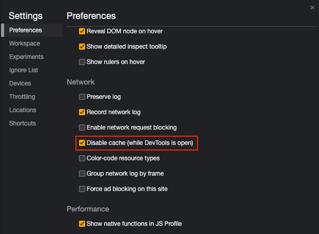
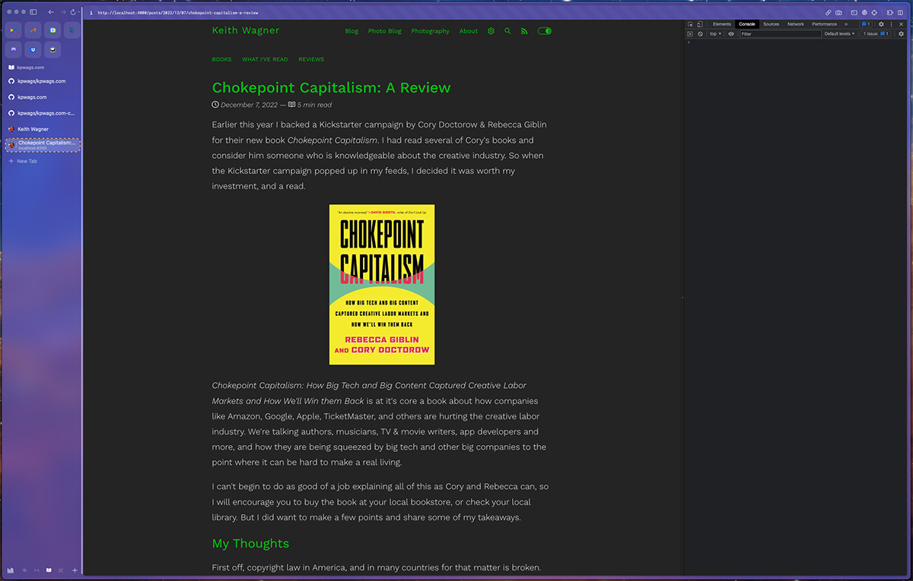

One thing I've started to do when I'm actively developing a website or application is keep the dev tools open docked to the side. I do this for two reasons.

## Disabling Cache

First, dev tools have a nice setting that allows you to disable the cache when the dev tools are open. If you open up your browser dev tools, under `Preferences > Network` there's an option to disable the cache

This just helps make sure I'm not debugging old Javascript or CSS. It doesn't happen too often, but can save some hassle.

## Catching Errors

The second, and probably more important reason is to catch errors and warnings early. While interacting with what I'm working on, any errors, warnings or other messages of note will often pop up in the JavaScript Console in the dev tools. Keeping the console open and docked to the side allows me to easily see what might be happening that I might not notice. It definitely can cut down debugging later.

And besides, with larger 4k and ultra wide monitors, I have the screen real estate.